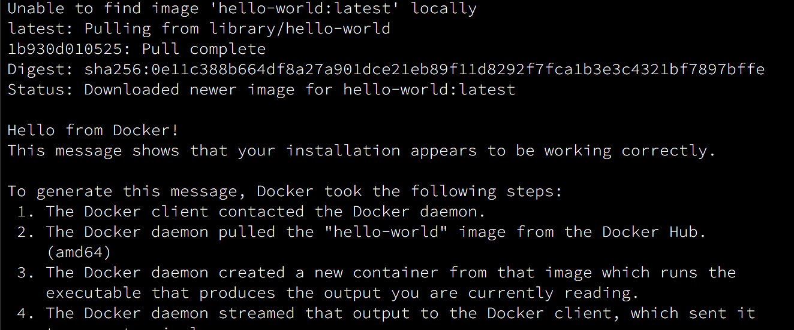

import {
  Appear,
  Notes,
  Head,
} from 'mdx-deck'
import { Invert } from 'mdx-deck/layouts'
import future from '@mdx-deck/themes/future'
import highlight from '@mdx-deck/themes/syntax-highlighter-prism'

export const themes = [
  future,
  highlight
]

<Head>
  <title>Docker Field Guide Workshop</title>

  <meta name="viewport" content="width=device-width, initial-scale=1" />
  <link href="https://unpkg.com/tailwindcss@^1.0/dist/tailwind.min.css" rel="stylesheet" crossOrigin="anonymous" />
  <link href="https://afeld.github.io/emoji-css/emoji.css" rel="stylesheet" crossOrigin="anonymous" />
</Head>


# Docker Workshop:

<h3 className="text-3xl italic text-gray-500">A Field Guide</h3>
<h5 className="text-sm mt-5 text-gray-600">Tom Gallacher, Ph.D</h5>

---

# Agenda*

- **09.30 - 10.50**: Docker fundamentals
- `Coffee`
- **11.10 - 12.30**: Dockerfile + services
- `Lunch`
- **13.30 - 14.50**: Multi-stage builds
- `Coffee`
- **15.10 - 16.30**: Dockerfile best practices

<span className="absolute bottom-0 right-0 mb-3 mr-5 text-base text-gray-500">*Guideline</span>

---

# Docker Fundamentals

---

import { Split } from 'mdx-deck/layouts'

# Why Docker?

<Split>


</Split>

- Lightweight
- Portable
- Scalable

<Notes>
  (1) containers run natively on Linux, sharing kernal; lower overhead
  (1) VMs full guest OS with virutal access to host resources through "hypervisor".
  (1) Flexible: Even the most complex applications can be containerized.
  (1) Lightweight: Containers leverage and share the host kernel.
  (1) Interchangeable: You can deploy updates and upgrades on-the-fly.
  (1) Portable: You can build locally, deploy to the cloud, and run anywhere.
  (1) Scalable: You can increase and automatically distribute container replicas.
  (1) Stackable: You can stack services vertically and on-the-fly.
</Notes>

---

# Terminology, terminology, terminology

- `docker` vs. `docker-engine` vs. `docker-machine` vs. `docker-compose`
- `image` vs. `container` vs. `swarms` vs. `stacks` vs. `services`
- `Dockerfile` vs `docker-compose.yml`

---

| | |
| --- | --- |
| `docker-compose` | client CLI for managing multi-docker container applications |
| `docker-machine` | remote management of distributed "`docker-daemon`"s |
| `docker` | docker "`client`" CLI |
| `docker-api`    | interface between "`docker-daemon`" and "`docker`" client |
| `docker-daemon` | the long runing "`docker-engine`" system process |
| `docker-engine` | brains which enables Docker's container runtime technology |

---

# Docker CLI

Getting started

---

```sh
docker --version
```

Docker version 18.09.2, build 6247962

---

# Hello world

```sh
docker run hello-world
```

---

<Invert>
  
</Invert>

---

# Docker (CLI) Concepts

- `Stack`
- `Swarm`
- `Service`
- `Container`
- `Image`
- `Dockerfile`
- `Volumes`

---

| | |
| --- | --- |
| `Stack` | inter-related "`services`" running in concert |
| `Swarm` | collection of multiple "`Docker daemons`" joined withina single "`cluster`" |
| `Service` | configuration of a `container` which can also be scaled across multiple "`Docker daemons`" |
| `Container` | running instance of an "`image`" |
| `Image` | read-only snapshot for being able to run a process |
| `Dockerfile` | recipe guide for creating an "`image`" |
| `Volumes` | persistent storage |

---

# Exercise...

2 basic exercies?

---

# Docker
Best practices

1. Single process per container
1. Keep images small
1. Use the right *base image*
1. Use multi-stage builds
1. Combine appropriate `RUN` directives
1. Combine shared components into a `base` image
1. Don't rely on `:latest` tag
1. Use `volumes` for storage

<Notes>
  - base image enables caching and better memory usage
  - Use `bind mounts` in development
</Notes>

---

# Ecercise

bind mount vols

---

`lunch`

---

# Dockerfile

Recipe guide for Docker images

---

# Dockerfile: FROM
# Dockerfile: RUN
# Dockerfile: COPY
# Dockerfile: EXPOSE
# Dockerfile: ENTRYPOINT
# Dockerfile: CMD

---

# Exercise

Build custom app with more than service

use docker-compose

---

# Multi-stage builds

FROM AS

COPY --from

---

# Exercise

Update above to use multi stage

---

#  Dockerfile

Best practices

---

1. Order directives from least to most likely to change,
    - e.g. `COPY` should come later
1. Increase specificity in `COPY` to avoid un-intentional cache bust,
    - e.g. don't use `COPY . `
1. Compress `RUN` pkg manager *update* and *install* into same line,
    - e.g. `RUN apt-get update && apt-get install`
1. Use official images where possible
    - reduces maintenance time, reduce size, configured for container use

<!-- /END -->
